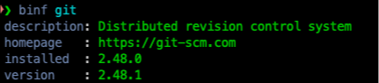

# binf
## Dispay the description, homepage URL and version of a brew formula

## 💾 Installation

fisher install ltaupiac/binf

Demo :



### Usage
Usage: binf [options] <formula>

Dispay the description, homepage URL and version of a brew formula

## Clipboard Support

If no argument is specified, `binf` uses the content of the clipboard as the formula name.

Options:

-t, --trace : Verbose mode

-d, --debug : Show debugging information

-h, --help : Show this help message

-v, --version : Show version

### Informations displayed
**descrition**: Description of the formula
**homepage**  : The homepage of project
**version**   : Last version available
**installed** : Current version installed on the device, if available

**Example:**

```shell
echo "fish" | pbcopy
binf
````

### Abbr

An abbr is defined : **,bf**

### Dependencies

- jq    : Command-line JSON processor

## ©️ License

[MIT](LICENSE)
